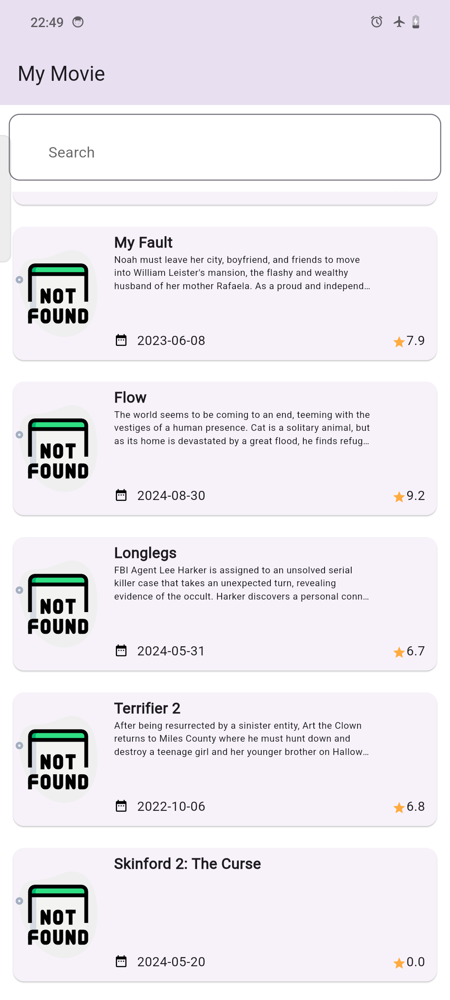
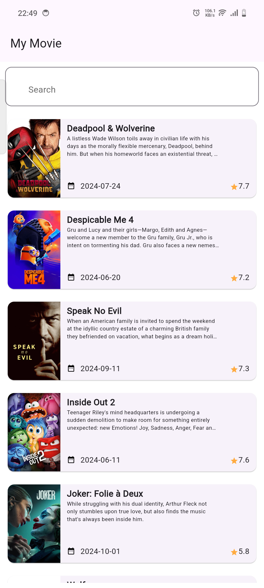
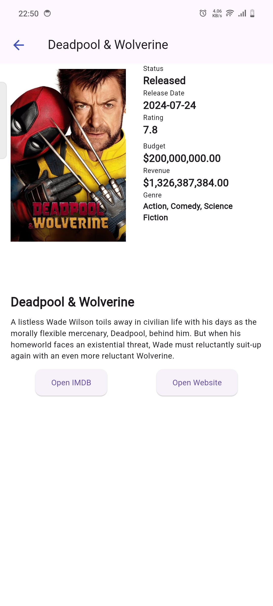

# Movie List App

A Movie List Project using TMDB Api third party

## Getting Started
-   Flutter Version 3.22.0
-   Dart Version 3.4.0

### Running Project
-   flutter clean
-   flutter pub get
-   dart run build_runner build
-   flutter run --flavor=dev

### Download File .Apk
-   Download file app-prod-release.apk

## Stack
- Clean Architecture with TDD pattern
- Bloc State Management
- Dio
- ObjectBox
- Implement Method Channel
- Mockito

## Preview

